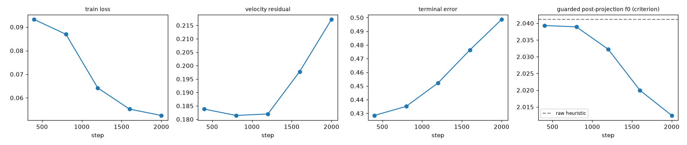

# T3 macro-stage bridge — validation report (development)

| Field | Value |
|---|---|
| Report | bridge_dev_r0 |
| Date | 2026-09-26 03:02 |
| Node | local (macOS, CPU) |
| Track | A-dev (HB-GP stand-in f1; f0 guard) |
| Tool versions | torch 2.14.0; run: HeurBridge 0.8.1 (package loaded at process start not recorded, git not recorded; meta written at git 12b29e1862473f9c3fc7a60e55805f4d563ba06e+dirty) |
| HeurBridge version / git | 0.10.0 / 12b29e1862473f9c3fc7a60e55805f4d563ba06e+dirty |
| Metric conventions | timing setup_hold_v1_2026-09-22; metrics_v2_2026-09-22; HPWL centre (pin_offset_v2); cost cost_v1_2026-09-25 |
| Feeds gate | T3 exit (post-guard f1 cost < raw on validation, paired p < 0.05) — NOT evaluated in a development run |
| Pre-registered test | - |
| alpha-ledger entry | - |
| Status of the claim | no claim (development / descriptive run) |

## Sample sizes

train designs ibm01,ibm02; validation design(s) ibm03; train ibm01: 128 pairs, train ibm02: 128 pairs, val ibm03: 128 pairs (training total 256); seeds 8; 1128082 model parameters

## Results



| step | train loss | velocity residual | terminal error | guarded f0 | raw f0 | alpha histogram |
|---|---|---|---|---|---|---|
| 400 | 0.09323 | 0.18380 | 0.42847 | 2.03933 | 2.04114 | {'0.0': 19, '0.5': 2, '1.0': 11} |
| 800 | 0.08693 | 0.18144 | 0.43511 | 2.03892 | 2.04114 | {'0.0': 15, '0.25': 7, '0.5': 3, '1.0': 7} |
| 1200 | 0.06422 | 0.18198 | 0.45223 | 2.03225 | 2.04114 | {'0.0': 19, '0.25': 4, '1.0': 9} |
| 1600 | 0.05523 | 0.19779 | 0.47630 | 2.01996 | 2.04114 | {'0.0': 6, '0.25': 3, '0.5': 6, '1.0': 17} |
| 2000 | 0.05254 | 0.21721 | 0.49867 | 2.01246 | 2.04114 | {'0.0': 3, '0.25': 3, '0.5': 12, '1.0': 14} |

Share of validation sources improved by the guard at the last validation: 0.90625.
MMD per round: single round (round 0; the macro stage has no upstream).

**Caveat.** On the validation design the velocity residual and terminal error rose from the first to the last validation (residual 0.1838 -> 0.2172; terminal 0.4285 -> 0.4987) while the guarded f0 criterion improved: the model moves the held-out sources further and the guard keeps the moves that lower f0, but the velocity field does not approach the held-out elites more closely. The criterion (post-guard cost) is the model-selection rule of T3.6; the residual trend is reported so that it is not mistaken for convergence.

## Failures (by name, counted as +inf in statistics)

none recorded in train.log

## Exact commands

```bash
python scripts/train_bridge.py --suite ibm --train ibm01,ibm02 --val ibm03 --archive ./archive_dev_v2 --runs ./runs/seed_dev --out ./checkpoints/bridge_dev_r0 --round 0 --seeds 8 --val-sources 32 --model small --steps 2000 --batch 16 --lr 0.0002 --val-every 400 --lam-ov 0.1 --sigma 0.01 --K 20 --device cpu --seed 0
```

## Notes

bridge checkpoint sha256 bc3d0d801e41c0f9fbc2daed147ba9b0a6407bd6304ae8bdac26da74a053ce12; archive snapshot train_r0_d75cfa8095d5
